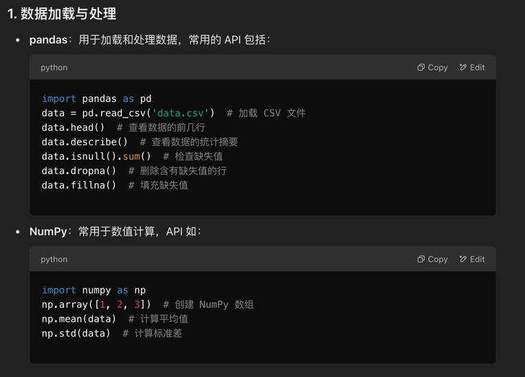
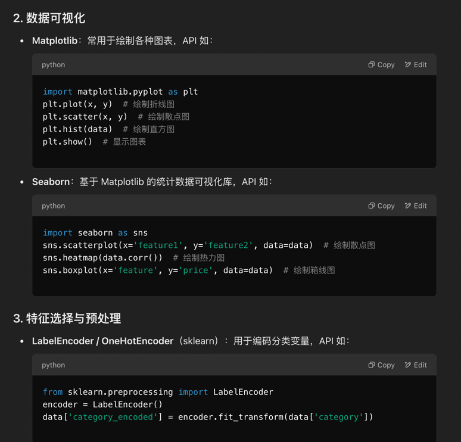
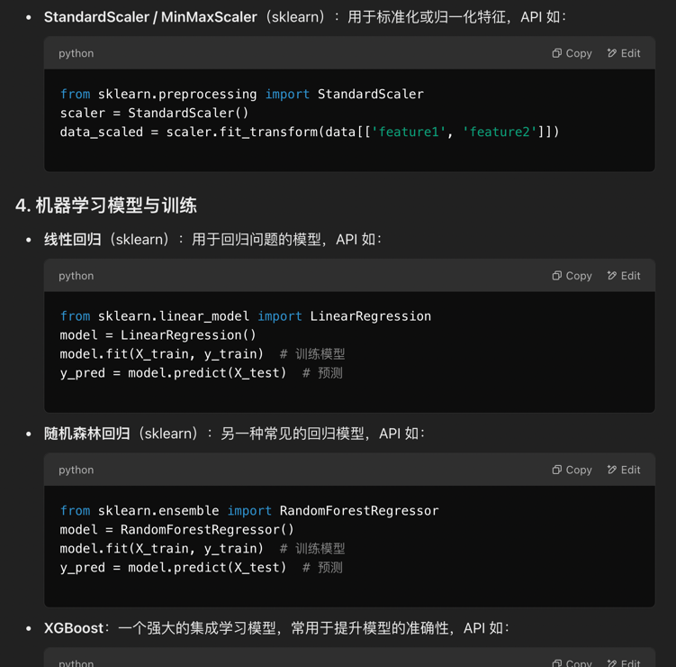
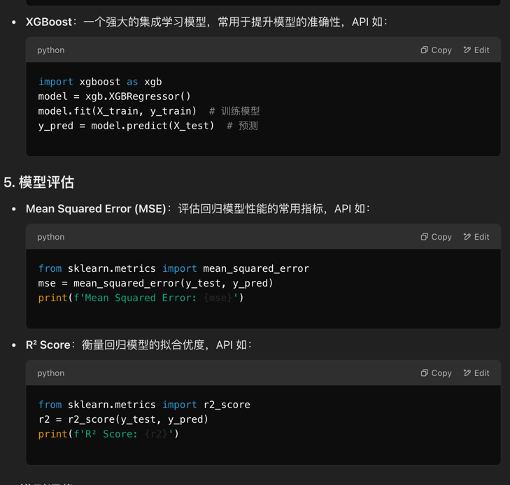
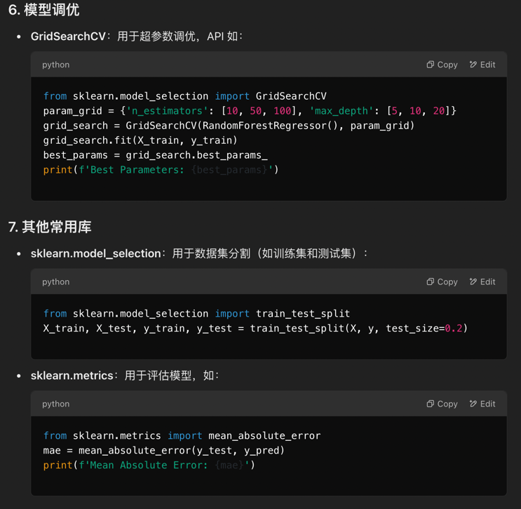
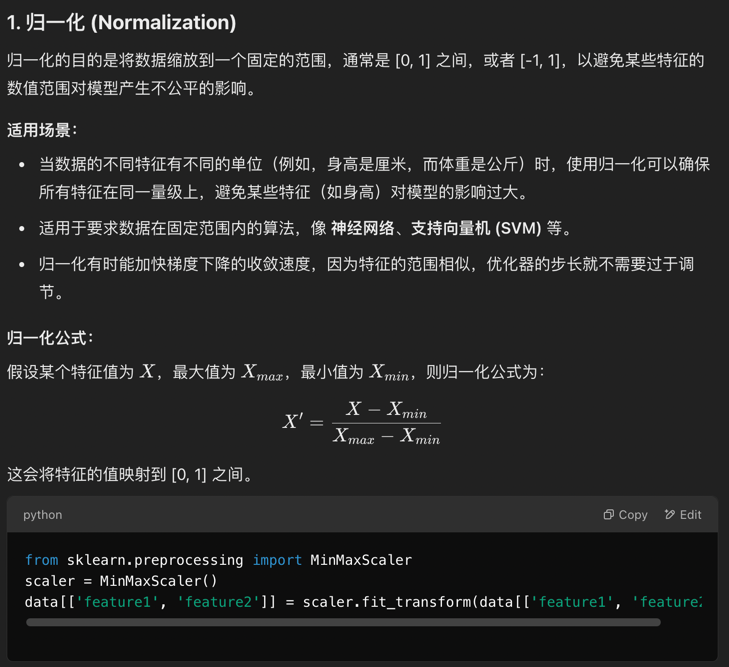
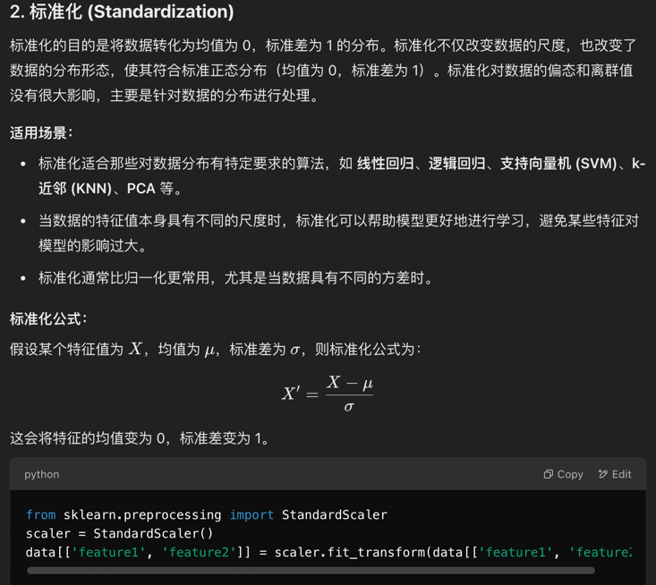
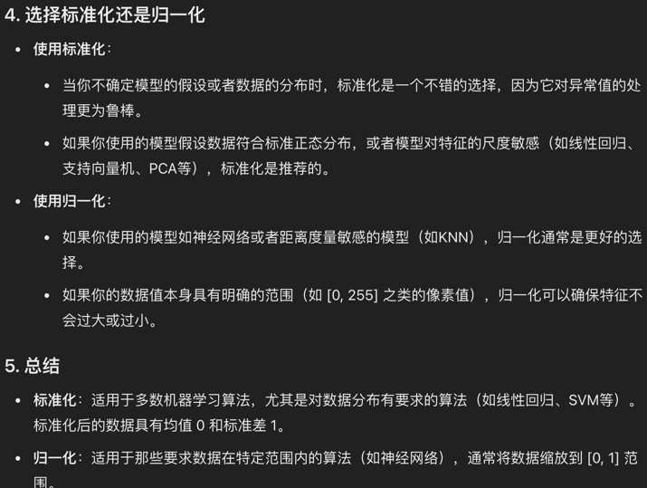

#### pandas merge data:
1.concat：用于沿着某个轴（行或列）拼接多个 DataFrame 或 Series。没有基于键的匹配。
适用场景：当你需要将数据框按行或列连接时。
2.merge：用于根据某些列（或多个列）合并 DataFrame，支持不同的连接方式（类似 SQL 的 JOIN）。
适用场景：当你需要基于某些键（列）进行合并时。
3.join：通常用于按索引合并 DataFrame，可以通过 on 参数指定列进行连接。
适用场景：当你想按索引合并数据框时。

