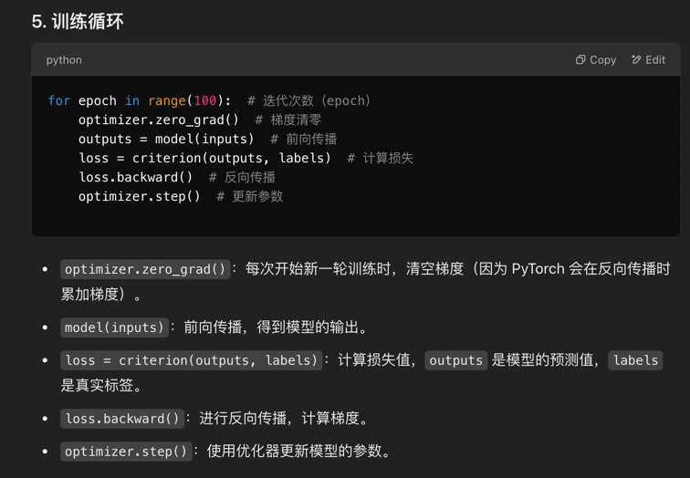
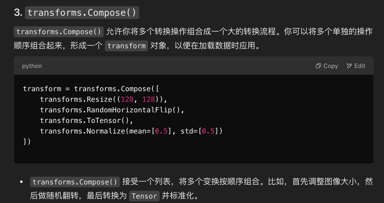

1. Dataset 类：自定义数据集类，重写 __len__() 和 __getitem__()，并返回每个样本的数据和标签。
2. DataLoader 类：批量加载数据，控制批次大小、是否打乱数据等。
3. transforms：对图像数据进行预处理，包括转换为 Tensor 格式、标准化等。
如何训练模型：使用 DataLoader 加载数据，进行批量训练。

4. transforms 是 PyTorch 中用于图像预处理的工具，它包括多种常见的图像操作，可以方便地将多个操作组合起来。在这篇教程中，transforms 的核心思想是通过 链式组合（transforms.Compose()）来将多个操作按顺序应用到数据上。

